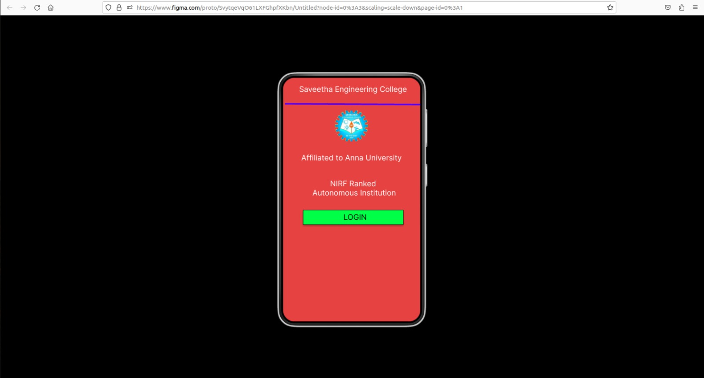
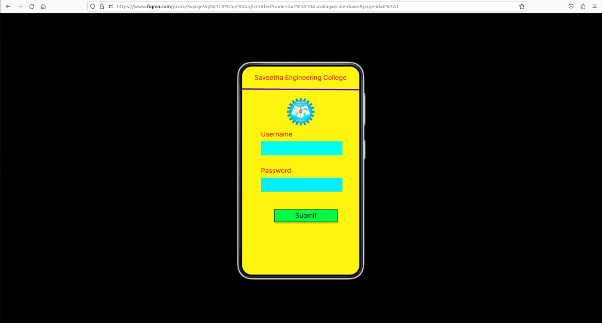
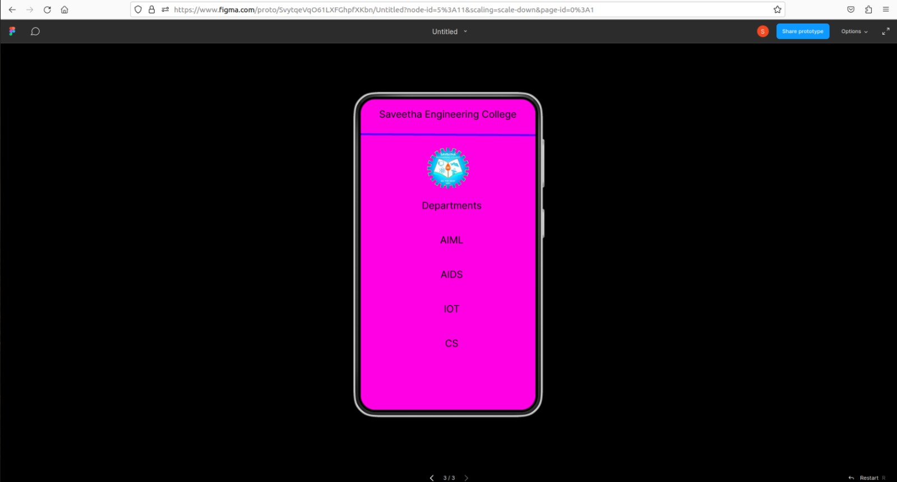

# Event Registration Web Application

## AIM:
To design, develop and deploy a web application for event registration.

## DESIGN STEPS:

### Step 1:

Create a new frame in the Figma tool.

### Step 2:

Select any one preset size of your choice.
### Step 3:

Select the shapes you need.
### Step 4:

Import images as needed.
### Step 5:

Create pages based on your need and link them.

### Step 6:
Validate the HTML and CSS code
Publish the website in the given URL.

## DESIGN:

## PROGRAM :
```
Home Page

/* Home Page */
position: relative;
width: 360px;
height: 640px;
background: #E74242;
/* Saveetha Engineering College */
position: absolute;
width: 331px;
height: 32px;
left: 18px;
top: 18px;
font-family: 'Inter';
font-style: normal;
font-weight: 400;
font-size: 20px;
line-height: 24px;
text-align: center;
color: #FFFFFF;
/* Line 2 */
position: absolute;
width: 748.99px;
height: 2.23px;
left: 5.01px;
top: 66px;
border: 4px solid #5200FF;
transform: rotate(0.33deg);
/* LOGO 1 */
position: absolute;
width: 87px;
height: 81px;
left: 136px;
top: 86px;
background: url(LOGO.png);
/* Affiliated to Anna University */
position: absolute;
width: 327px;
height: 43px;
left: 16px;
top: 198px;
font-family: 'Inter';
font-style: normal;
font-weight: 400;
font-size: 20px;
line-height: 24px;
text-align: center;
color: #FFFFFF;
/* NIRF Ranked Autonomous Institution */
position: absolute;
width: 303px;
height: 81px;
left: 35px;
top: 266px;


Login Page

font-family: 'Inter';
font-style: normal;
font-weight: 400;
font-size: 20px;
line-height: 24px;
text-align: center;
color: #FFFFFF;
/* Rectangle 1 */
box-sizing: border-box;
position: absolute;
width: 264px;
height: 39px;
left: 52px;
top: 347px;
background: #00FF47;
border: 1px solid #000000;
box-shadow: 0px 4px 4px rgba(0, 0, 0, 0.25);
/* LOGIN */
position: absolute;
width: 206px;
height: 25px;
left: 86px;
top: 354px;
font-family: 'Inter';
font-style: normal;
font-weight: 400;
font-size: 20px;
line-height: 24px;
/* identical to box height */
text-align: center;
color: #000000;
/* Login Page */
position: relative;
width: 360px;
height: 640px;
background: #FFF50F;
/* Saveetha Engineering College */
position: absolute;
width: 345px;
height: 32px;
left: 7px;
top: 22px;
font-family: 'Inter';
font-style: normal;
font-weight: 400;
font-size: 20px;
line-height: 24px;
text-align: center;
color: #FF0000;
/* LOGO 2 */
position: absolute;
width: 86px;
height: 87px;
left: 137px;
top: 96px;
background: url(LOGO.png);
/* Line 3 */
position: absolute;
width: 748.99px;
height: 2.23px;
left: 0.01px;
top: 67px;
border: 4px solid #5200FF;
transform: rotate(0.33deg);
/* Line 4 */
position: absolute;
width: 748.99px;
height: 1.74px;
left: 0.01px;
top: 67.49px;
border: 4px solid #5200FF;
transform: rotate(0.33deg);
/* Rectangle 2 */
position: absolute;
width: 250px;
height: 43px;
left: 58px;
top: 230px;
background: #00FFF0;
/* Rectangle 3 */
position: absolute;
width: 250px;
height: 43px;
left: 58px;
top: 342px;
background: #00F0FF;
/* Username */
position: absolute;
width: 240px;
height: 34px;
left: 58px;
top: 196px;
font-family: 'Inter';
font-style: normal;
font-weight: 400;
font-size: 20px;
line-height: 24px;
color: #FF0000;
/* Password */
position: absolute;
width: 240px;


SEC Page

height: 34px;
left: 58px;
top: 308px;
font-family: 'Inter';
font-style: normal;
font-weight: 400;
font-size: 20px;
line-height: 24px;
color: #FF0000;
/* Rectangle 2 */
box-sizing: border-box;
position: absolute;
width: 194px;
height: 39px;
left: 99px;
top: 439px;
background: #00FF47;
border: 1px solid #000000;
box-shadow: 0px 4px 4px rgba(0, 0, 0, 0.25);
/* Submit */
position: absolute;
width: 206px;
height: 25px;
left: 93px;
top: 446px;
font-family: 'Inter';
font-style: normal;
font-weight: 400;
font-size: 20px;
line-height: 24px;
/* identical to box height */
text-align: center;
color: #000000;
/* SEC Page */
position: relative;
width: 360px;
height: 640px;
background: #FF00E5;
/* Saveetha Engineering College */
position: absolute;
width: 345px;
height: 32px;
left: 7px;
top: 19px;
font-family: 'Inter';
font-style: normal;
font-weight: 400;
font-size: 20px;
line-height: 24px;
text-align: center;
color: #000000;
/* Departments */
position: absolute;
width: 345px;
height: 32px;
left: 15px;
top: 207px;
font-family: 'Inter';
font-style: normal;
font-weight: 400;
font-size: 20px;
line-height: 24px;
text-align: center;
color: #000000;
/* AIML */
position: absolute;
width: 345px;
height: 32px;
left: 15px;
top: 278px;
font-family: 'Inter';
font-style: normal;
font-weight: 400;
font-size: 20px;
line-height: 24px;
text-align: center;
color: #000000;
/* AIDS */
position: absolute;
width: 345px;
height: 32px;
left: 15px;
top: 349px;
font-family: 'Inter';
font-style: normal;
font-weight: 400;
font-size: 20px;
line-height: 24px;
text-align: center;
color: #000000;
/* IOT */
position: absolute;
width: 345px;
height: 32px;
left: 15px;
top: 420px;
font-family: 'Inter';
font-style: normal;
font-weight: 400;
font-size: 20px;
line-height: 24px;
OUTPUT:
Home Page
text-align: center;
color: #000000;
/* CS */
position: absolute;
width: 345px;
height: 32px;
left: 15px;
top: 491px;
font-family: 'Inter';
font-style: normal;
font-weight: 400;
font-size: 20px;
line-height: 24px;
text-align: center;
color: #000000;
/* Line 5 */
position: absolute;
width: 748.99px;
height: 1.7px;
left: 0px;
border: 4px solid #5200FF;
transform: matrix(1, 0.01, 0.01, -1, 0, 0);
/* LOGO 3 */
position: absolute;
width: 86px;
height: 87px;
left: 137px;
top: 99px;
background: url(LOGO.png);
```

## OUTPUT:





## Result:

